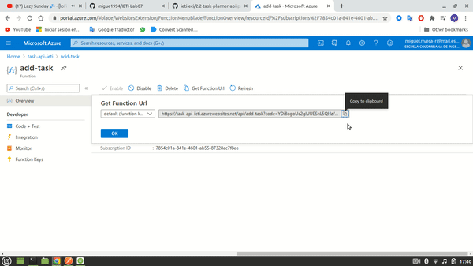
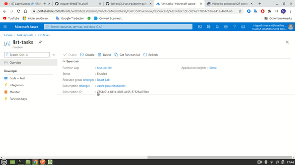

# 2.2-task-planner-api-part-2

## Author

- Miguel Ángel Rivera Rojas

## Part 1 endpoint test

## Part 2 endpoint test

## Part 3 link to front-end repository

- https://dev.azure.com/miguelrivera-r/_git/Lab-07

## Part 3 link to front-end deploytment

- https://lab-07-frontend.azurewebsites.net/

## Honor Code

La presencia de este documento en este repositorio es un compromiso explícito de los colaboradores de seguir el siguiente código de honor:

Código de Honor
------
Debes seguir el Código de honor del ingeniero de sistemas para defender el estándar de integridad académica de la ECI:

- Tus respuestas a tareas, cuestionarios y exámenes deben ser tu propio trabajo (excepto para las tareas que permiten explícitamente la colaboración).

- No puedes compartir tus soluciones de tareas, cuestionarios o exámenes con otra persona a menos que el instructor lo permita explícitamente. Esto incluye cualquier cosa escrita por ti, como también cualquier solución oficial proporcionada por el docente o el monitor del curso.

- No puedes participar en otras actividades que mejorarán de manera deshonesta tus resultados o que mejorarán de manera deshonesta o dañarán los resultados de otras personas.
